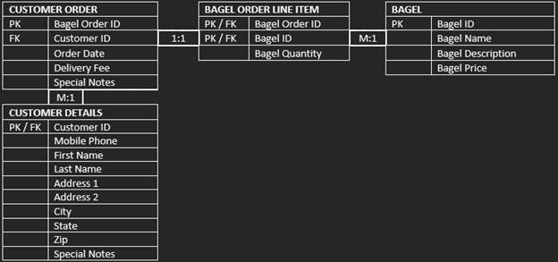

<html>

<head>
<meta http-equiv=Content-Type content="text/html; charset=windows-1252">
<meta name=Generator content="Microsoft Word 15 (filtered)">

<!--
 /* Font Definitions */
 @font-face
	{font-family:"Cambria Math";
	panose-1:2 4 5 3 5 4 6 3 2 4;}
@font-face
	{font-family:Calibri;
	panose-1:2 15 5 2 2 2 4 3 2 4;}
 /* Style Definitions */
 p.MsoNormal, li.MsoNormal, div.MsoNormal
	{margin-top:0in;
	margin-right:0in;
	margin-bottom:8.0pt;
	margin-left:0in;
	line-height:107%;
	font-size:11.0pt;
	font-family:"Calibri",sans-serif;}
p.MsoListParagraph, li.MsoListParagraph, div.MsoListParagraph
	{margin-top:0in;
	margin-right:0in;
	margin-bottom:8.0pt;
	margin-left:.5in;
	line-height:107%;
	font-size:11.0pt;
	font-family:"Calibri",sans-serif;}
p.MsoListParagraphCxSpFirst, li.MsoListParagraphCxSpFirst, div.MsoListParagraphCxSpFirst
	{margin-top:0in;
	margin-right:0in;
	margin-bottom:0in;
	margin-left:.5in;
	line-height:107%;
	font-size:11.0pt;
	font-family:"Calibri",sans-serif;}
p.MsoListParagraphCxSpMiddle, li.MsoListParagraphCxSpMiddle, div.MsoListParagraphCxSpMiddle
	{margin-top:0in;
	margin-right:0in;
	margin-bottom:0in;
	margin-left:.5in;
	line-height:107%;
	font-size:11.0pt;
	font-family:"Calibri",sans-serif;}
p.MsoListParagraphCxSpLast, li.MsoListParagraphCxSpLast, div.MsoListParagraphCxSpLast
	{margin-top:0in;
	margin-right:0in;
	margin-bottom:8.0pt;
	margin-left:.5in;
	line-height:107%;
	font-size:11.0pt;
	font-family:"Calibri",sans-serif;}
.MsoChpDefault
	{font-family:"Calibri",sans-serif;}
.MsoPapDefault
	{margin-bottom:8.0pt;
	line-height:107%;}
@page WordSection1
	{size:8.5in 11.0in;
	margin:1.0in 1.0in 1.0in 1.0in;}
div.WordSection1
	{page:WordSection1;}
 /* List Definitions */
 ol
	{margin-bottom:0in;}
ul
	{margin-bottom:0in;}
-->

</head>

<body lang=EN-US style='word-wrap:break-word'>
	
	
	
	

<h1>Preview Coming Soon!</h1>
<!--

Jack T. Neely  
 

                Hello, my name is Jack Neely. I’m a database
designer. Here, I am showcasing my database development skills by walking
through the process of designing Entity Relationship Diagrams (ERDs), as well
as developing a database in MySQL and testing with queries. 

My first project is for a local business called “Nora’s
Bagel Bin.” 
 

First, we import data from the bagel order form, which was provided for this
project.

 
 

 

Next, we transform this data into First Normal Form (1NF). 
For this project, the transformation was provided.

As you can tell, there are no repeating values in this table
and a primary key has been defined.

&nbsp;

Following this, we now transform the data to Second Normal
Form (2NF).

As you can see, all non-prime attributes are separated by their
functional dependencies.  
In other words, primary keys related to other attributes have been separated
into their own tables.

You may notice the practicality of this standard from a
business owner’s perspective. 
It can sometimes be easier to examine data that has undergone categorization.

Note the cardinality representations (1:1 for one-to-one,
and M:1 for many-to-one).

Each Bagel Order is unique, and the primary key Bagel Order
ID is used as a Foreign Key in Bagel Order Line Item. Bagels are also unique,
and there can be many bagels in each bagel order line item, as described by
Bagel Quantity.

Sequentially, we transform to Third Normal Form (3NF). 
This allows us to improve consistency by removing transitive dependencies for
non-prime attributes. 

Customer details are separated from customer orders to
preserve functional dependence and provide lossless data management. Each Customer
Order contains one Foreign Key, Customer ID, which is referenced by the Primary
Key in Customer Details. We notice here that the cardinality established is
Many to One, as a given customer can place many orders.

Finally, we transform the dataset into a working model
schema. 
This involved specifying datatypes and formatting value names and attribute names.

&nbsp;

That’s it. We have the dataset normalized into 3NF and
transformed into a usable set of tables. 
We can perform queries on this, insert into it, create indexes, perform joins,
etc.

 

&nbsp;

 
The second project is to create a database for the business “Jaunty Coffee Co.” 
 

We can start by creating the database, tables, values, and
attributes:

 

For this project, I’m using MySQL Workbench. 
 
We can execute this selection of the code, and it returns the following:

The execution passes.

&nbsp;

Next, we will populate each table with dummy data using
INSERT INTO statements:

And execute in MySQL Workbench to view results: 

 

&nbsp;

Continued:

&nbsp;

&nbsp;

&nbsp;

&nbsp;

&nbsp;

Now that we have populated our tables and queried them successfully,
we can create a view. 
For this example, let’s create a view EMPLOYEE_VIEW from the EMPLOYEE table. We
will grab every attribute and perform a concatenation on first_name and
last_name to create the attribute employee_full_name and select to view our
results.

Now let’s create an index on the COFFEE table and test: 

&nbsp;

We can perform other queries. Here, we will perform a Select
From Where (SFW) query on the COFFEE table with a comparison operand to list
all rows where the price_per_pound of coffee is equal to or less than $5.00. 

 

&nbsp;

Lastly for this project, we can join tables. Let’s join
COFFEE with both COFFEE_SHOP and SUPPLIER. We can do this with two separate
INNER JOIN statements, then ORDER BY coffee_id. 

&nbsp;

That’s it for our second project, and that completes our
task. We created an Entity Relationship Diagram (ERD) for “Nora’s Bagel Bin”
and transformed the original data from unnormalized to First Normalized Form
(1NF) to Second Normalized Form (2NF) to Third Normalized Form (3NF) and
finally to useable data properly formatted for database use. After that, we
create a database for Jaunty Coffee Co. using MySQL. We executed our code in
MySQL Workbench to test and output our data. 

1.&nbsp;&nbsp;&nbsp;&nbsp;&nbsp;&nbsp; We
created an entire relational database, 

2.&nbsp;&nbsp;&nbsp;&nbsp;&nbsp;&nbsp; we
populated several tables using our own data, 

3.&nbsp;&nbsp;&nbsp;&nbsp;&nbsp;&nbsp; we
created a view that simplified the name attributes for the EMPLOYEE table, 

4.&nbsp;&nbsp;&nbsp;&nbsp;&nbsp;&nbsp; we
created an index on the COFFEE table,

5.&nbsp;&nbsp;&nbsp;&nbsp;&nbsp;&nbsp; we
performed a Select From Where query on the COFFEE table for price_per_pound,
and

6.&nbsp;&nbsp;&nbsp;&nbsp;&nbsp;&nbsp; we
joined the tables COFFEE_SHOP and SUPPLIER on the COFFEE table by related
attributes, ordered by coffee_id, and viewed our final result.

 
We accomplished our goals. The PRIMARY KEY (here is that we have inserted into
ourselves an index of database management knowledge.) REFERENCES work_skill(Now
we can inner join select data management organizations that can select from
where we live our expertise.) 
 
 
Thank you. 
 
 
 

­ 

-->

</body>

</html>
